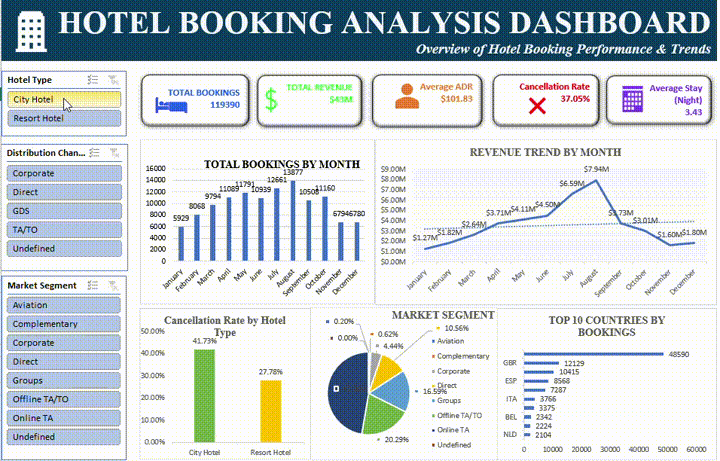
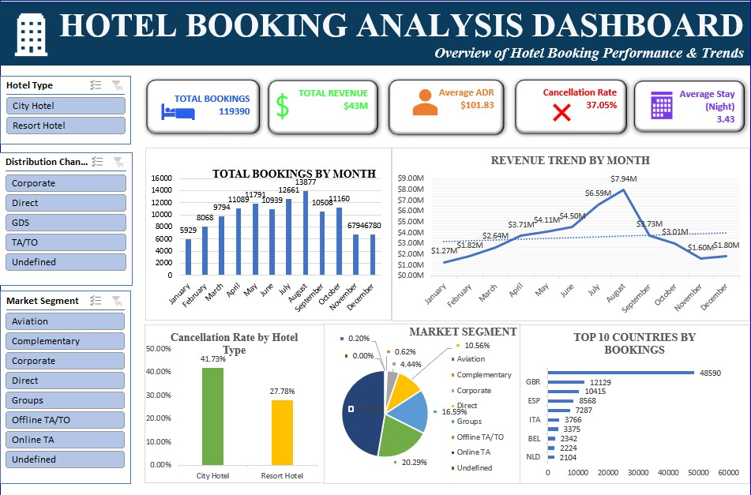

# 🏨 Hotel Bookings Analytics Dashboard (Excel)

An interactive Excel dashboard analyzing **119,390 hotel booking records** to uncover trends in revenue, cancellations, customer segments, and seasonal demand — built using Pivot Tables, Pivot Charts, Slicers, and KPI cards.

## 🎥 Demo



## 📊 Dashboard Preview



## 🎯 Objective

Help hotel management understand booking patterns, identify revenue drivers, and reduce cancellation rates through data-driven insights.

## 📌 Key Performance Indicators

| KPI | Value |
|---|---|
| Total Bookings | 119,390 |
| Total Revenue | $43M |
| Average ADR (Daily Rate) | $101.83 |
| Cancellation Rate | 37.05% |
| Average Stay Length | 3.43 nights |

## 🔍 Key Insights

**1. Seasonality drives both bookings and revenue**
- Bookings peak in **August (13,877)** and **July (11,793)**, with the lowest volumes in **January (5,929)** and **November (6,794)**.
- Revenue follows a similar but sharper curve — peaking at **$7.94M in August** (from a low of **$1.27M in January**), then dropping sharply post-summer to **$1.60M–$1.80M** in Nov/Dec.
- This indicates a strong **summer-season dependency**; off-season months (Jan, Nov, Dec) may need targeted promotions.

**2. Cancellation rate varies significantly by hotel type**
- **City Hotel: 41.73%** cancellation rate vs. **Resort Hotel: 27.78%**.
- City Hotel cancellations are ~14 points higher — likely due to business travelers with more flexible/changeable plans vs. resort guests on planned vacations.
- Overall cancellation rate of **37.05%** is high and represents significant lost-revenue risk; this is a strong candidate for a deeper deposit-policy/lead-time analysis.

**3. Direct & Online channels dominate bookings**
- **Online TA (Travel Agencies)** is the largest single segment at **~20.29%** of bookings.
- **Groups** follow closely behind, contributing a sizable share.
- **Complementary and Undefined segments are negligible (<1% combined)**, suggesting these categories could be cleaned up or merged in future analysis.

**4. Market concentration by country**
- The **UK (GBR) dominates bookings with 48,590** — more than 4x the next closest country.
- **Portugal-region/ESP (Spain) follows at 12,129**, then **FRA, ITA, BEL**.
- Top 2 countries (GBR, ESP) account for the vast majority of bookings — suggests marketing/partnership focus should prioritize these markets, while diversification into mid-tier countries (ITA, BEL, NLD) could reduce geographic concentration risk.

**5. Revenue vs. booking volume mismatch (Aug vs. surrounding months)**
- August has both the highest bookings (13,877) AND highest revenue ($7.94M) — a 2.7x revenue jump from July despite only a ~1,500 booking increase, implying **higher ADR or longer stays during peak season** (premium pricing in effect).

## 🛠️ Tools & Techniques Used

- **Microsoft Excel** — Pivot Tables, Pivot Charts, Slicers
- **Data Cleaning** — handled nulls, duplicates, derived columns
- **Calculated Fields** — Total Stay Nights, Total Revenue, Month Number
- **KPI Cards** for at-a-glance metrics
- **Interactive Filtering** via slicers (Hotel Type, Market Segment, Distribution Channel)

## 📁 Repository Structure

```
hotel-bookings-dashboard/
├── Hotel_Bookings_Dashboard.xlsx       # Full interactive dashboard (open in Excel)
├── data/
│   └── hotel_bookings_cleaned.csv.gz   # Cleaned dataset (119K rows, 40 columns)
├── assets/
│   ├── demo_preview.gif                # Dashboard walkthrough preview
│   └── Hotel_Bookings.jpg              # Dashboard screenshot
└── README.md
```

## 📈 Dashboard Sheets

| Sheet | Purpose |
|---|---|
| `Cleaned_Data` | Raw cleaned dataset (119,391 rows × 40 columns) |
| `Pivot_Tables` | Underlying pivot tables powering the dashboard |
| `KPI_Calculations` | Summary KPI formulas |
| `DASHBOARD` | Final interactive dashboard view with charts & slicers |

## 🔍 Dataset Fields (Sample)

`hotel`, `is_canceled`, `lead_time`, `arrival_date`, `stays_in_weekend/week_nights`, `adults`, `children`, `meal`, `country`, `market_segment`, `distribution_channel`, `reserved_room_type`, `deposit_type`, `customer_type`, `adr`, `reservation_status`, `Total Revenue`

## ▶️ How to Use

1. Download `Hotel_Bookings_Dashboard.xlsx`
2. Open in Excel (Pivot Tables enabled)
3. Go to the `DASHBOARD` sheet
4. Use slicers to filter by Hotel Type, Market Segment, or Distribution Channel

## 💡 Recommendations

- **Target off-season promotions** (Jan, Nov, Dec) to flatten demand curve and improve year-round occupancy
- **Investigate City Hotel cancellation drivers** (deposit type, lead time, customer type) given the 41.73% rate
- **Implement dynamic pricing** to capture the peak-season ADR uplift seen in August across other high-demand months
- **Diversify country marketing spend** beyond GBR/ESP to reduce dependency on top 2 markets

## 👤 Author

**Sumanth** — Data Analyst | SQL • Power BI (PL-300) • Excel | Ex-Oracle Apps DBA
